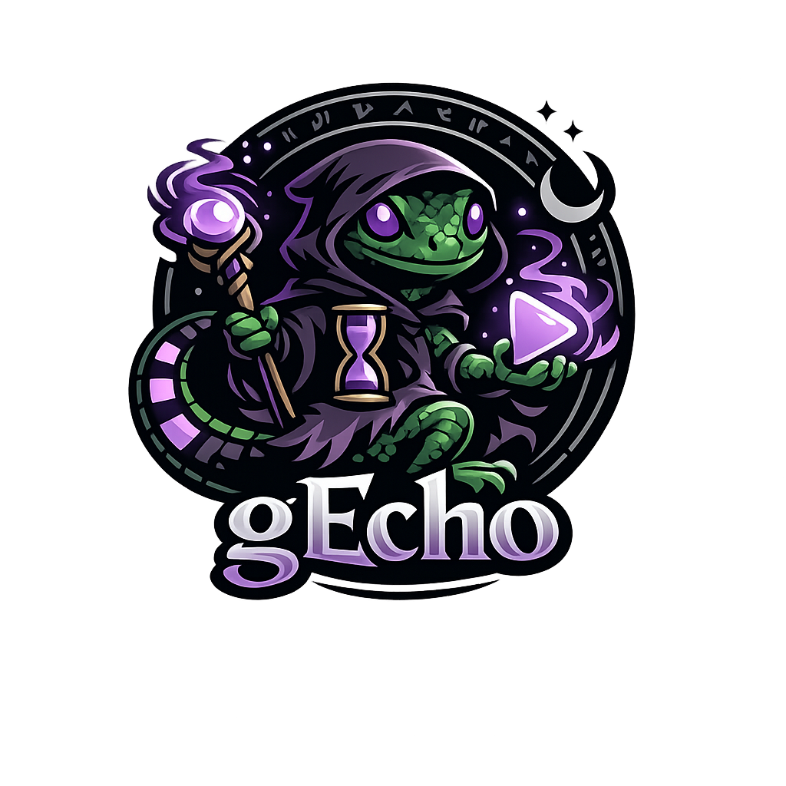

# 🦎 gEcho

[](https://marketplace.visualstudio.com/items?itemName=PalmEmanuel.gEcho)
[](https://marketplace.visualstudio.com/items?itemName=PalmEmanuel.gEcho)



**Record, replay, and generate reproducible GIFs from VS Code interactions.**

gEcho is a VS Code extension with two recording modes:

- **Echo mode** — Records your actions (typing, commands, selections) into a replayable **echo** (JSON)
- **GIF mode** — Records the VS Code window as a screen-captured **GIF** (via ffmpeg)

**Combined:** Record an echo once → replay it any time → capture the replay as a GIF. Deterministic, version-controlled demo GIFs for your README, docs, or CI pipeline.

## Why gEcho?

| Problem | gEcho Solution |
|---|---|
| Manual screen recording is tedious and inconsistent | Record once, replay forever |
| GIFs go stale when UI changes | Re-run the echo to regenerate |
| Demo recordings are not version-controllable | Echoes are JSON — diff, review, commit |
| Cross-platform recording is painful | One extension, works on macOS, Linux, and Windows |
| CI-generated GIFs require complex infrastructure | Replay echoes in headless CI environments |

## Quick Start

### Record an Echo (Echo Mode)

1. Open the Command Palette (`Ctrl+Shift+P` / `Cmd+Shift+P`)
2. Run **gEcho: Start Echo Recording**
3. Perform your demo actions in VS Code — type code, open files, use the terminal
4. Run **gEcho: Stop Echo Recording**
5. Save the echo as `my-demo.gecho.json`

### Record a GIF Directly

1. Run **gEcho: Start GIF Recording**
2. Perform your demo
3. Run **gEcho: Stop GIF Recording**
4. The GIF is saved to your configured output directory

### Replay an Echo as GIF

1. Open a `.gecho.json` echo
2. Run **gEcho: Replay as GIF**
3. gEcho replays your recorded actions while capturing the screen
4. Output: a reproducible, pixel-perfect GIF

> **New to gEcho?** See the full [Getting Started guide](docs/getting-started.md) for detailed setup instructions including ffmpeg installation.

## Echo Format

Echoes are human-readable JSON files with a `.gecho.json` extension:

```jsonc
{
  "version": "1.0",
  "metadata": {
    "name": "IntelliSense Demo",
    "description": "Show KQL autocompletion in action",
    "windowSize": { "width": 1920, "height": 1080 }
  },
  "steps": [
    { "type": "command", "id": "workbench.action.files.newUntitledFile" },
    { "type": "wait", "ms": 500 },
    { "type": "type", "text": "Resources | where ", "delay": 60 },
    { "type": "wait", "ms": 1000, "until": "idle" },
    { "type": "key", "key": "Ctrl+Space" },
    { "type": "wait", "ms": 2000 }
  ]
}
```

### Step Types

| Step | Description | Example |
|---|---|---|
| `type` | Type text character-by-character | `{ "type": "type", "text": "hello", "delay": 55 }` |
| `command` | Execute a VS Code command | `{ "type": "command", "id": "editor.action.formatDocument" }` |
| `key` | Press a keyboard shortcut | `{ "type": "key", "key": "Ctrl+Shift+P" }` |
| `select` | Change text selection | `{ "type": "select", "anchor": [0, 0], "active": [0, 10] }` |
| `wait` | Pause for a duration or until idle | `{ "type": "wait", "ms": 2000, "until": "idle" }` |
| `openFile` | Open a file in the editor | `{ "type": "openFile", "path": "src/index.ts" }` |
| `paste` | Paste text from clipboard | `{ "type": "paste", "text": "pasted content" }` |
| `scroll` | Scroll the editor | `{ "type": "scroll", "direction": "down", "lines": 10 }` |

> **Full reference:** See the [Echo Format Reference](docs/echo-reference.md) for complete documentation of all step types, fields, and authoring tips.

## Commands

| Command | Description |
|---|---|
| `gEcho: Start Echo Recording` | Record user actions to an echo |
| `gEcho: Stop Echo Recording` | Stop and save the echo |
| `gEcho: Start GIF Recording` | Record the VS Code window as a GIF |
| `gEcho: Stop GIF Recording` | Stop and save the GIF |
| `gEcho: Replay Echo` | Replay an echo (no recording) |
| `gEcho: Replay as GIF` | Replay an echo while recording a GIF |

## Configuration

| Setting | Default | Description |
|---|---|---|
| `gecho.ffmpegPath` | `ffmpeg` | Path to ffmpeg binary |
| `gecho.outputDirectory` | `~/gecho-recordings` | Where to save recordings |
| `gecho.gif.fps` | `10` | Frames per second for GIF output |
| `gecho.gif.width` | `1920` | GIF output width (height scales proportionally) |
| `gecho.gif.quality` | `high` | GIF quality preset: `high`, `balanced`, `small` |
| `gecho.replay.speed` | `1.0` | Replay speed multiplier |

> **Full reference:** See the [Configuration Reference](docs/configuration.md) for detailed descriptions of all settings, quality presets, and workspace vs user configuration.

## Requirements

- **VS Code** 1.101.0 or later
- **ffmpeg** installed and available in PATH ([install guide](https://ffmpeg.org/download.html))

## How It Works

### Echo Recording

gEcho hooks into VS Code's extension API to capture:

- **Text changes** via `onDidChangeTextDocument` — every character insertion/deletion
- **Selections** via `onDidChangeTextEditorSelection` — cursor movements and selections
- **File switches** via `onDidChangeActiveTextEditor`
- **Keystrokes** via the VS Code `type` command interception

Each event is timestamped relative to recording start, preserving the natural typing rhythm.

### Screen Recording

gEcho detects the VS Code window position and dimensions, then launches ffmpeg to capture that screen region:

- **macOS:** AppleScript for window bounds, `avfoundation` capture
- **Linux:** `xdotool`/`xwininfo` for window bounds, `x11grab` capture
- **Windows:** PowerShell for window bounds, `gdigrab` capture

### Replay

The replay engine reads an echo and executes each step sequentially, honoring the recorded timing. Steps are executed via VS Code's command API — `type` for typing, `executeCommand` for commands, etc.

## Limitations

### No Mouse Event Recording

VS Code's extension API does not expose mouse position, click, or scroll events. Echo recording captures keyboard-driven actions only. For mouse-driven actions (clicking buttons, scrolling), manually add `command`, `key`, or `scroll` steps to the echo.

### Webview Interaction

VS Code panels like Copilot Chat, Settings, and extension webviews accept keyboard input via the `type` command when focused. However, gEcho cannot read webview content or click specific webview elements. Use `wait` steps with appropriate timeouts for asynchronous operations (like waiting for a Chat response).

### Wayland (Linux)

Screen recording on Linux requires X11. Wayland is not yet supported (this is a known limitation shared with Chronicler and most screen recording tools).

### Window Must Stay Still

Like all region-based screen recorders, gEcho captures a fixed screen region. Moving or resizing the VS Code window during recording will produce artifacts.

> **Full list:** See the [Limitations](docs/limitations.md) page for a detailed explanation of all limitations and workarounds.

## CI Integration

Echoes can be replayed in CI to generate GIFs automatically:

```yaml
- name: Generate demo GIFs
  run: |
    code --install-extension gecho.vsix
    code --command gecho.replayAsGif echoes/demo.gecho.json
```

For scenarios requiring authentication (e.g., Copilot Chat), run gEcho locally where credentials are available, then commit the generated GIFs.

> **Full guide:** See the [CI Integration guide](docs/ci-integration.md) for cross-platform workflows, configuration, and troubleshooting.

## Documentation

| Guide | Description |
|-------|-------------|
| [Getting Started](docs/getting-started.md) | Install ffmpeg, install the extension, first recording |
| [Echo Format Reference](docs/echo-reference.md) | Complete documentation of all step types with examples |
| [Configuration Reference](docs/configuration.md) | All settings with defaults and descriptions |
| [CI Integration](docs/ci-integration.md) | Replay echoes in GitHub Actions |
| [Limitations](docs/limitations.md) | What cannot be recorded/replayed and workarounds |
| [Troubleshooting](docs/troubleshooting.md) | Common issues and solutions |

## Acknowledgements

Inspired by:

- [vscode-hacker-typer](https://github.com/jevakallio/vscode-hacker-typer) — keystroke recording and replay in VS Code
- [Chronicler](https://github.com/arciisine/vscode-chronicler) — cross-platform VS Code screen recording
- [bARGE](https://github.com/PalmEmanuel/bARGE) — the Azure Resource Graph Explorer that sparked this project

## License

MIT
